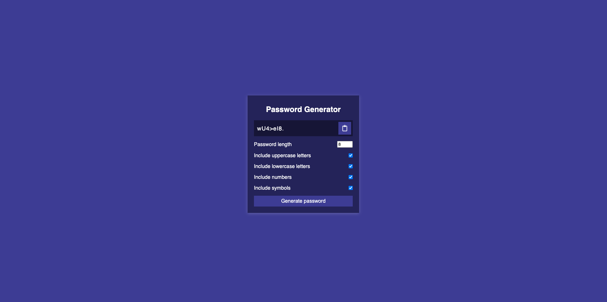

# OSU Bootcamp Homework 3

## Descripton of Solution 

In order to get the different character types to generate randomly, I used four functions, one for each character type. The `fromCharCode()` function allows me to use the browser character set already known by the browser. For example, for `getRandomLower()` I need the character numbers from 97 to 122 for lower case a-z. So I just did `Math.floor(Math.random()` to generate a random number between 0 and 26, then add 97 to it. For the Symobols, I created a string with the symbols in it. Then I just used the `Math.floor(Math.random() * symbols.length)` to generate a random number that falls within the string length. 

```
function getRandomLower() {
	return String.fromCharCode(Math.floor(Math.random() * 26) + 97);
}

function getRandomUpper() {
	return String.fromCharCode(Math.floor(Math.random() * 26) + 65);
}

function getRandomNumber() {
	return +String.fromCharCode(Math.floor(Math.random() * 10) + 48);
}

function getRandomSymbol() {
	const symbols = '!@#$%^&*(){}[]=<>/,.'
	return symbols[Math.floor(Math.random() * symbols.length)];
}
```
---


## Screen Shot of Deployed Application 



---
## Link to Deployed Application 

[Link to Deployed Application]()

---